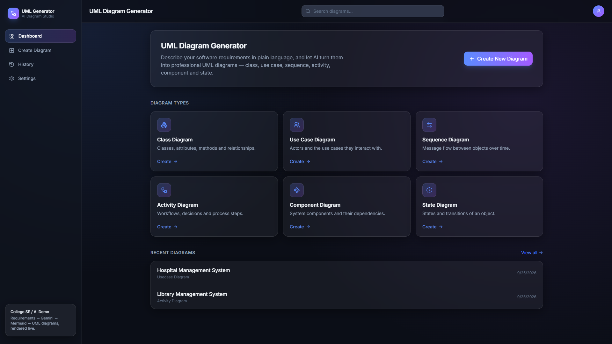
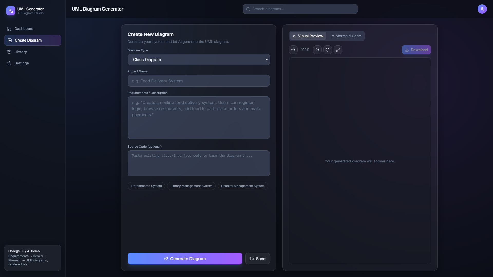
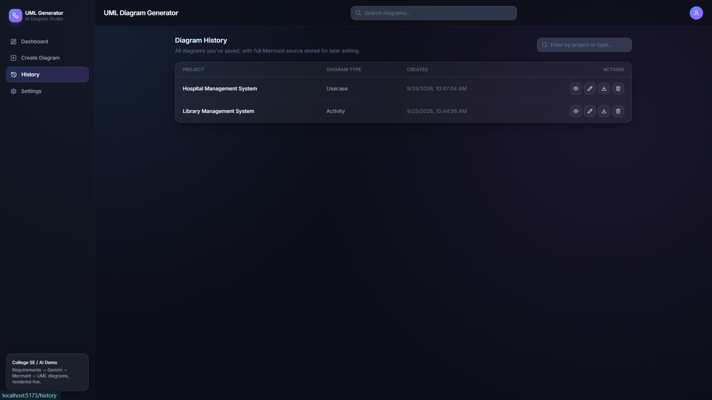
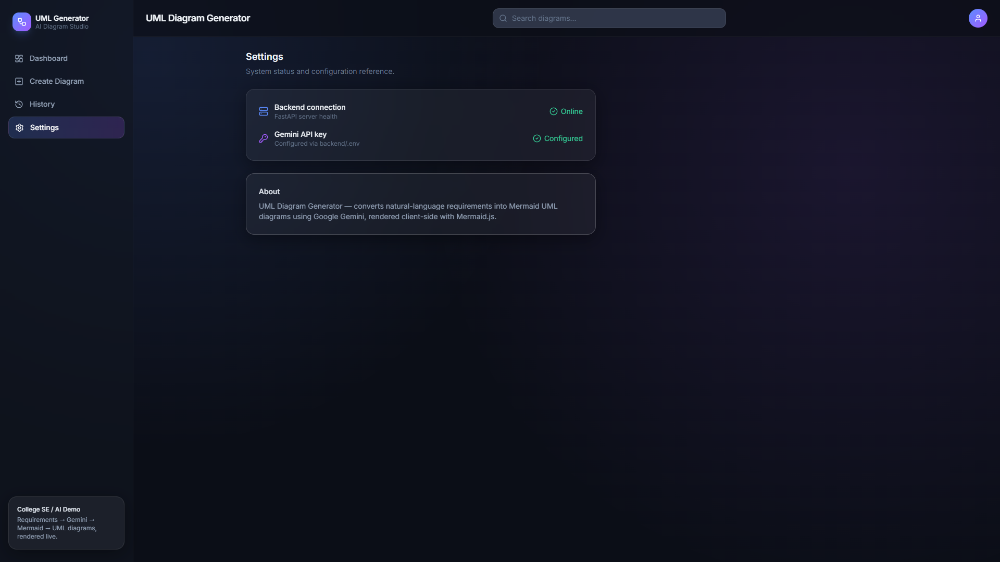

# UML Diagram Generator

AI-assisted full-stack application that converts software requirements or source code into UML diagrams using **Google Gemini** and **Mermaid.js**.

## Features

* 🤖 AI-generated UML diagrams
* 📊 Class, Use Case, Sequence, Activity, Component & State diagrams
* ✏️ Manual Mermaid code editing
* 🔍 Live diagram preview with zoom & fullscreen
* 💾 Save and manage diagram history
* 📥 Export as PNG, SVG & PDF
* 🌙 Modern dark green developer UI
* 🗄️ SQLite database

## Tech Stack

**Frontend:** React, Vite, Tailwind CSS, React Router, Axios, Mermaid.js, jsPDF, Lucide React

**Backend:** Python, FastAPI, Pydantic, SQLAlchemy, Uvicorn

**AI:** Google Gemini API

**Database:** SQLite

## Architecture

```text
React + Vite
     │
   Axios
     ▼
FastAPI Backend
     │
 ┌───┴──────────┐
 ▼              ▼
Gemini API    SQLite
 │
 ▼
Mermaid.js
 │
 ▼
PNG / SVG / PDF
```

## Workflow

```text
Requirements
     ↓
Select UML Type
     ↓
Gemini AI
     ↓
Mermaid Code
     ↓
Diagram Preview
     ↓
Edit / Save / Download
```

## Project Structure

```text
uml-diagram-generator/
├── frontend/
│   ├── src/
│   │   ├── components/
│   │   ├── pages/
│   │   ├── services/
│   │   ├── App.jsx
│   │   └── index.css
│   └── package.json
│
├── backend/
│   ├── app/
│   │   ├── models/
│   │   ├── routes/
│   │   ├── schemas/
│   │   ├── services/
│   │   ├── database.py
│   │   └── main.py
│   ├── requirements.txt
│   └── .env.example
│
└── README.md
```

## Setup

### Backend

```bash
cd backend
python -m venv venv
venv\Scripts\activate
pip install -r requirements.txt
```

Create `backend/.env`:

```env
GEMINI_API_KEY=your_api_key_here
DATABASE_URL=sqlite:///./uml_generator.db
FRONTEND_ORIGIN=http://localhost:5173
```

Run:

```bash
python -m uvicorn app.main:app --reload
```

### Frontend

```bash
cd frontend
npm install
npm run dev
```

Open:

```text
http://localhost:5173
```

Backend API:

```text
http://localhost:8000/docs
```

## Screenshots

### Dashboard
<p align="center">
  
</p>

### Create Diagram
<p align="center">
  
</p>
### History
<p align="center">
  
</p>

### Settings
<p align="center">
  
</p>


**Input:**

```text
Food Delivery System

Customers can register, browse restaurants,
add food to cart, place orders and make payments.
```

**Output:**

```text
Requirements
     ↓
Google Gemini
     ↓
Mermaid UML Code
     ↓
Generated Diagram
```


## Author

**Prachi Ankush**

B.Tech Computer Engineering — Software Engineering

---

⭐ **UML Diagram Generator — From requirements to UML with AI.**
